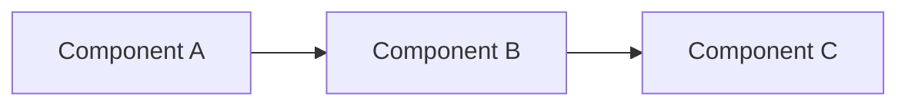

# <Project_Name> Task Tracking

This document tracks all tasks for the <Project_Name> project. Each task has a unique ID and corresponding detailed task file.

---

## Project Overview

**Brief Description**: [What this project does]

### Tech Stack
- **Operating System**: [e.g., RHEL 9]
- **Primary Language**: [e.g., Python 3.11]
- **Framework**: [e.g., Flask, Django]
- **Database**: [e.g., PostgreSQL, MongoDB]
- **Other Key Technologies**: [e.g., Docker, Apache, Redis]

### Architecture

**Note**: [Key architectural decisions or constraints]

---

## Task Management System

### Task ID Format

`TASK-[Priority][Number]`

**Priority Prefix**:
- `C` - Critical
- `H` - High  
- `M` - Medium
- `L` - Low

**Number**: Sequential 3-digit number within priority level

**Examples**: 
- `TASK-C001` = Critical task #1
- `TASK-H005` = High priority task #5
- `TASK-M012` = Medium priority task #12

### Priority Definitions

| Priority | Description | Examples |
|----------|-------------|----------|
| **C - Critical** | MVP blockers, production issues, dependencies blocking other tasks | Security vulnerabilities, system down, blocking bugs |
| **H - High** | MVP features, core functionality, essential integrations | Core user features, primary APIs, key integrations |
| **M - Medium** | Enhancements, optimizations, important but not critical features | Performance improvements, additional features, refactoring |
| **L - Low** | Nice-to-have, future research, cosmetic improvements | UI polish, documentation, future explorations |

### Effort Estimates

| Effort | Time Estimate | Description |
|--------|---------------|-------------|
| **S** | 1-2 days | Small changes, bug fixes, config updates |
| **M** | 3-5 days | Moderate features, integrations, refactoring |
| **L** | 1-2 weeks | Major features, complex integrations |
| **XL** | 2+ weeks | Architecture changes, multiple integrations |

### Status Values

| Status | Meaning |
|--------|---------|
| **TODO** | Available for assignment, ready to start |
| **IN_PROGRESS** | Currently being worked on |
| **BLOCKED** | Waiting on dependency or external issue |
| **REVIEW** | Complete, awaiting review/testing |
| **DONE** | Fully complete and integrated |

### Branch Naming Convention

Each task is worked on in its own Git branch named after the task ID:
- `TASK-C001` for Critical task 001
- `TASK-H001` for High priority task 001
- `TASK-M001` for Medium priority task 001  
- `TASK-L001` for Low priority task 001

### Task Files

Each task has a corresponding detailed document in the `/TASKS` folder:
- Filename format: `TASK-[ID].md` (e.g., `TASK-H001.md`)
- Use `TASK_TEMPLATE.md` as the basis for new task files

### Source of Truth

Task state lives in two places, and duplicated state drifts. The rule:

- **The task file (`TASKS/TASK-[ID].md`) is the source of truth.** The tables in this document are an *index* — a convenience view, never the authority.
- Any change to a task's status, assignee, or dependencies MUST update both the task file and the index table **in the same commit**. A commit that updates one without the other is incomplete.
- On any disagreement between table and task file, the task file wins, and the discrepancy gets fixed immediately — before other work on that task proceeds.

---

## Critical Priority Tasks

| Task ID | Title | Effort | Status | Assignee | Dependencies | Description |
|---------|-------|--------|--------|----------|--------------|-------------|
| TASK-C001 | Fix production authentication bug | S | TODO | Unassigned | None | Users unable to log in due to token expiration issue |
| TASK-C002 | Database backup restoration | M | IN_PROGRESS | DevOps | TASK-C001 | Restore corrupted production database from backup |

---

## High Priority Tasks

| Task ID | Title | Effort | Status | Assignee | Dependencies | Description |
|---------|-------|--------|--------|----------|--------------|-------------|
| TASK-H001 | Implement user registration API | M | TODO | Backend | TASK-C001 | Create REST API endpoint for new user registration |
| TASK-H002 | Set up CI/CD pipeline | L | TODO | DevOps | None | Configure GitHub Actions for automated testing and deployment |
| TASK-H003 | Add payment processing | L | BLOCKED | Backend | TASK-H001 | Integrate Stripe payment gateway for subscriptions |

---

## Medium Priority Tasks

| Task ID | Title | Effort | Status | Assignee | Dependencies | Description |
|---------|-------|--------|--------|----------|--------------|-------------|
| TASK-M001 | Optimize database queries | M | TODO | Backend | TASK-C002 | Add indexes and optimize slow queries identified in logs |
| TASK-M002 | Implement rate limiting | S | TODO | Backend | TASK-H001 | Add rate limiting middleware to prevent API abuse |

---

## Low Priority Tasks

| Task ID | Title | Effort | Status | Assignee | Dependencies | Description |
|---------|-------|--------|--------|----------|--------------|-------------|
| TASK-L001 | Update README documentation | S | TODO | Documentation | None | Improve installation and setup instructions |
| TASK-L002 | Add dark mode to UI | M | TODO | Frontend | None | Implement dark mode theme with user preference toggle |

---

## Completed Tasks Archive

| Task ID | Title | Effort | Completed | Assignee | Description |
|---------|-------|--------|-----------|----------|-------------|
| TASK-H000 | Initial project setup | M | 2024-12-01 | DevOps | Set up repository, basic structure, and initial configuration |

---

*Last Updated: YYYY-MM-DD*

## Quick Reference

**To add a new task**:
1. Determine priority and assign next sequential number for that priority
2. Add row to appropriate priority table above
3. Create detailed task file using `TASK_TEMPLATE.md`
4. Create git branch with task ID name

**To update a task**:
1. Update the detailed task file (source of truth) with progress
2. Update status/assignee/other fields in the index table above — same commit
3. Update "Last Updated" timestamp

**To complete a task**:
1. Change status to DONE
2. Complete all sections in task file
3. Move task row to "Completed Tasks Archive" section
4. Note completion date
